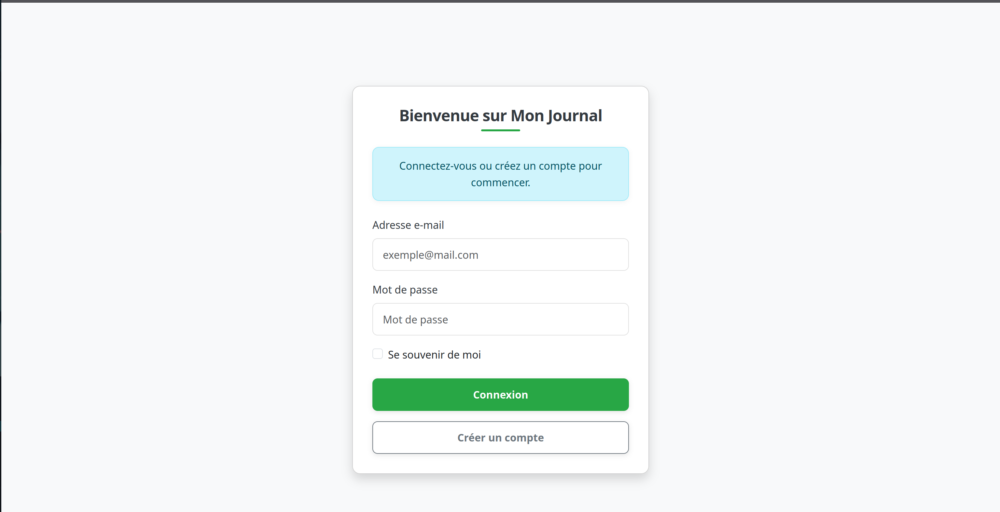
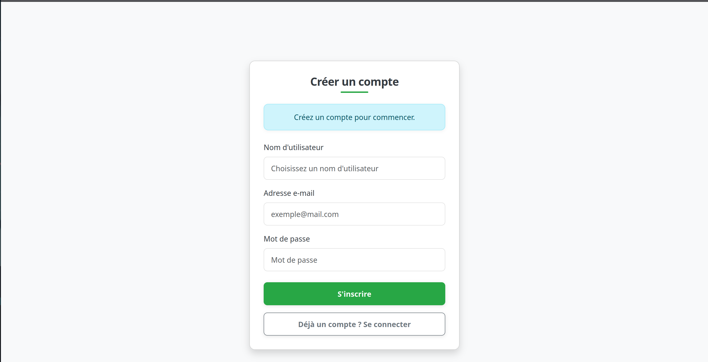
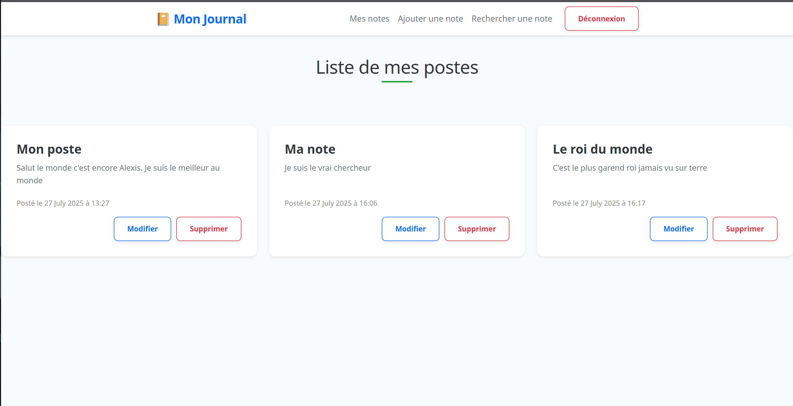
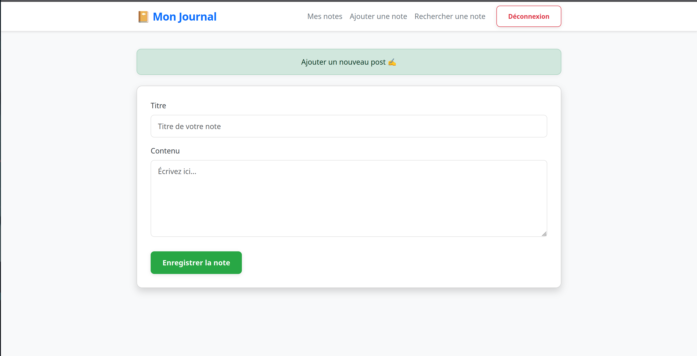
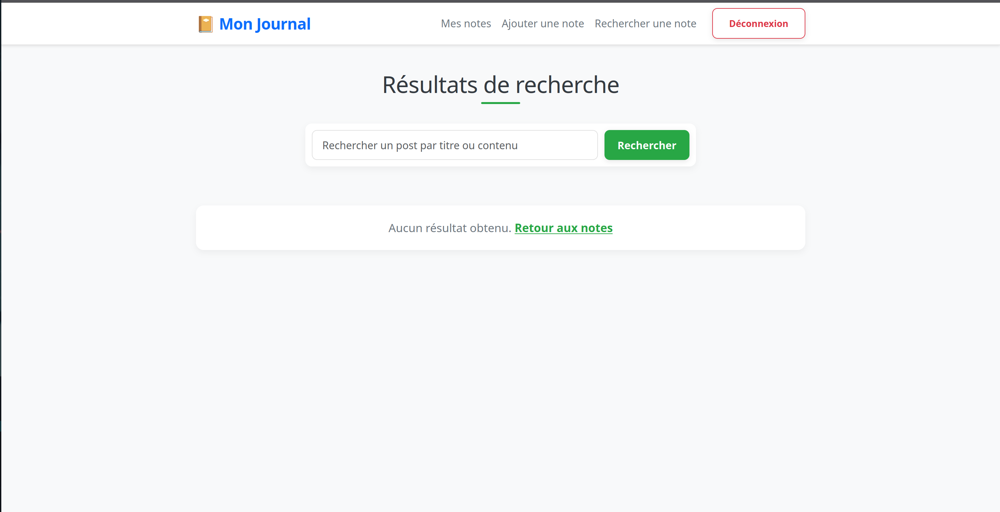

# MonJournalPy : Votre Carnet de Notes Personnel en Ligne


## Table des Matières

1.  [À Propos du Projet](#à-propos-du-projet)
2.  [Fonctionnalités](#fonctionnalités)
3.  [Technologies Utilisées](#technologies-utilisées)
4.  [Aspects de Sécurité](#aspects-de-sécurité)
5.  [Installation et Lancement](#installation-et-lancement)
6.  [Arborescence du Projet](#arborescence-du-projet)


---

## 1. À Propos du Projet

**MonJournalPy** est une application web simple mais robuste qui permet aux utilisateurs de créer, gérer et organiser leurs notes personnelles en ligne. Conçue avec Flask, ce projet démontre une compréhension complète des opérations **CRUD (Create, Read, Update, Delete)** et des bonnes pratiques de développement web, avec une attention particulière portée aux aspects de sécurité fondamentaux.

L'objectif de ce projet était d'explorer et de solidifier les compétences en :
* Développement back-end avec le framework Flask.
* Gestion de base de données relationnelle via l'ORM SQLAlchemy.
* Implémentation de l'authentification et des sessions utilisateur.
* Application des principes de sécurité web dès les premières étapes du développement.

---

## 2. Fonctionnalités

* **Authentification Utilisateur :**
    * **Inscription :** Création sécurisée de nouveaux comptes utilisateurs.
    * **Connexion :** Accès sécurisé aux comptes existants.
    * **Déconnexion :** Déconnexion propre de la session utilisateur.
* **Gestion Complète des Notes (CRUD) :**
    * **Créer :** Ajouter de nouvelles notes avec titre et contenu.
    * **Afficher :** Visualiser toutes les notes de l'utilisateur connecté.
    * **Modifier :** Mettre à jour le titre et/ou le contenu des notes existantes.
    * **Supprimer :** Retirer définitivement des notes.
* **Recherche de Notes :** Rechercher des notes par mots-clés dans le titre ou le contenu.
* **Messages Flash :** Retour d'information utilisateur via des notifications (succès, erreur, information).

    
    
    
    
    
---

## 3. Technologies Utilisées

* **Python 3.x :** Langage de programmation principal.
* **Flask 2.x :** Micro-framework web pour le développement back-end.
* **Flask-SQLAlchemy :** Extension Flask pour l'intégration de SQLAlchemy.
* **SQLAlchemy :** ORM (Object-Relational Mapper) pour l'interaction avec la base de données.
* **SQLite :** Système de gestion de base de données léger et basé sur des fichiers.
* **Werkzeug (via Flask) :** Utilisé pour le hachage sécurisé des mots de passe.
* **Jinja2 :** Moteur de templating pour générer le HTML dynamique.
* **HTML5 / CSS3 (avec Bootstrap) :** Pour la structure et le style de l'interface utilisateur.

---

## 4. Aspects de Sécurité

Ce projet intègre plusieurs pratiques de sécurité essentielles pour protéger les données utilisateur :

* **Hachage de Mots de Passe :** Les mots de passe des utilisateurs sont stockés sous forme de hachages salés (grâce à `werkzeug.security`), jamais en clair dans la base de données. Cela protège contre les fuites de données.
* **Gestion Sécurisée des Sessions :** Les sessions utilisateurs sont gérées par Flask avec une clé secrète pour prévenir le détournement de session.
* **Contrôle d'Accès Basé sur l'Utilisateur :** Toutes les opérations CRUD (lecture, modification, suppression de notes) sont strictement contrôlées pour s'assurer qu'un utilisateur ne peut accéder ou modifier que ses propres notes. Toute tentative d'accéder aux données d'un autre utilisateur est bloquée.
* **Validation des Entrées (basique) :** Bien que les validations de formulaires avancées ne soient pas l'objet principal de ce projet, le code est structuré pour permettre leur ajout et éviter les erreurs de base.

---

## 5. Installation et Lancement

Suivez ces étapes pour configurer et exécuter MonJournalPy localement.

### Prérequis

* **Python 3.x** installé sur votre machine.
* **Git** pour cloner le dépôt (facultatif).

### Étapes

1.  **Clonez le dépôt :**
    ```bash
    git clone https://github.com/Alex171-studo/MonJournalPy.git
    cd MonJournalPy
    ```

2.  **Créez un environnement virtuel (recommandé) :**
    ```bash
    python -m venv .venv
    ```

3.  **Activez l'environnement virtuel :**
    * **Windows :**
        ```bash
        .\venv\Scripts\activate
        ```
    * **macOS / Linux :**
        ```bash
        source venv/bin/activate
        ```

4.  **Installez les dépendances :**
    Si vous avez un fichier `requirements.txt` dans votre projet, installez toutes les dépendances en exécutant :
    ```bash
    pip install -r requirements.txt
    ```

    Sinon, installez Flask et SQLAlchemy manuellement :
    ```bash
    pip install Flask Flask-SQLAlchemy Werkzeug
    ```
            

5.  **Créez la base de données :**
    Assurez-vous que le fichier `create_db.py` existe déjà avec le contenu suivant pour créer les tables de la base de données :
    ```python
    from app import app, db
    with app.app_context():
        db.create_all()
    print("Base de données créée avec succès !")
    ```

    Exécutez ensuite :
    * **Windows :**
        ```bash
        python create_db.py
        ```
    * **macOS / Linux :**
        ```bash
        python3 create_db.py
        ```
    Si cette étape échoue et que vous ne voyez pas le message "base de données créée avec succès"  essayez de créez le dossier instance à la racine du projet soit manuellement soit avec:
    ```bash
    mkdir instance
    ```

6.  **Définissez les variables d'environnement (optionnel mais recommandé pour la clé secrète) :**
    * Créez un fichier `.env` à la racine du projet ou définissez les variables directement dans votre terminal :
    ```bash
    FLASK_APP=app.py
    FLASK_ENV=development
    SECRET_KEY='votre_cle_secrete_ultra_securisee_ici' # Changez ceci pour une vraie clé forte !
    ```

    * Ou dans le terminal (temporaire) :
        * **Windows (CMD) :** `set SECRET_KEY=votre_cle_secrete_ultra_securisee_ici`
        * **Windows (PowerShell) :** `$env:SECRET_KEY="votre_cle_secrete_ultra_securisee_ici"`
        * **macOS / Linux :** `export SECRET_KEY='votre_cle_secrete_ultra_securisee_ici'`

7.  **Lancez l'application Flask :**
    ```bash
    flask run
    ```
    Mais je vous conseille fortement de s'assurer d'être à la racine du projet et d'exécuter
    * **Windows :**
        ```bash
        python app.py
        ```
    * **macOS / Linux :**
        ```bash
        python3 app.py
        ```
8.  **Accédez à l'application :**
    Ouvrez votre navigateur et naviguez vers `http://127.0.0.1:5000/`.
    

## 7. **Arborescence du projet**
    MonJournalPy/
        ├── .venv/
        |── images/              
        │   ├── img1.png
        │   ├── img2.png
        │   ├── img3.png
        │   ├── img3.png
        │   ├── img5.png              
        ├── instance/               
        │   └── users.sqlite3
        ├── static/              
        │   ├── css/              
        │       ├── style.css/g
        │   ├── images/
        │       ├── logo.png
        ├── templates/              
        │   ├── base.html
        │   ├── login.html
        │   ├── register.html
        │   ├── about.html
        │   ├── add_post.html
        │   ├── edit_post.html
        │   └── search.html
        ├── app.py                  
        ├── config.py               
        ├── models.py               
        ├── create_db.py            
        ├── .gitignore             
        ├── README.md  

Voys pouvez me suivre sur Linkedin avec ce lien https://www.linkedin.com/in/godwill-aguemon-51a38436a/

